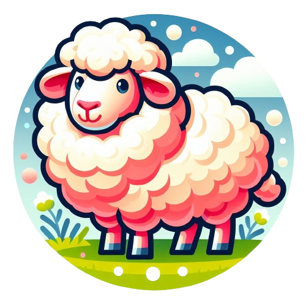
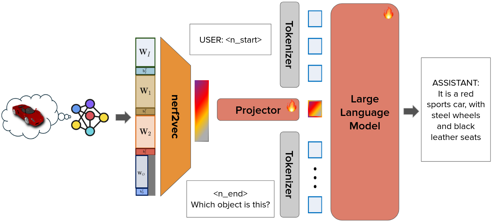

<br>
<p align="center">
<h1 align="center">LLaNA: Large Language and NeRF Assistant (NeurIPS&nbsp;2024)</h1> 

  <p align="center">
    <a href='https://andreamaduzzi.github.io/' target='_blank'>Andrea Amaduzzi (*)</a>&emsp;
    <a href='https://www.unibo.it/sitoweb/pierluigi.zama' target='_blank'>Pierluigi Zama Ramirez</a>&emsp;
    <a href='https://www.unibo.it/sitoweb/giuseppe.lisanti' target='_blank'>Giuseppe Lisanti</a>&emsp;
    <a href='https://www.unibo.it/sitoweb/samuele.salti' target='_blank'>Samuele Salti</a>&emsp;
    <a href='https://www.unibo.it/sitoweb/luigi.distefano' target='_blank'>Luigi Di Stefano</a>&emsp;
    <br>
    Computer Vision Lab, University of Bologna, Italy
  </p>
</p>

<p align="center">
  <a href="https://arxiv.org/abs/2406.11840" target='_**blank**'>
    
  </a> 
  <a href="https://andreamaduzzi.github.io/llana/" target='_blank'>
    
  </a>
  <a href="" target='_blank'>
    
  </a>
  <a href="https://github.com/CVLAB-Unibo/LLaNA/stargazers" target='_blank'>
    
  </a>
</p>
<p>
    <p align="center">
    <b> (*) I am currently seeking internship opportunities! 
    <br> Feel free to contact me at 
    <a href="mailto:andrea.amaduzzi4@unibo.it">andrea.amaduzzi4@unibo.it</a> or connect with me on 
    <a href="https://x.com/andrea_amaduzzi" target="_blank">Twitter</a>.</b>
</p>
</p>
</p>

## 
<p align="center">
  
</p>


<!-- contents with emoji -->
## 📋 Contents
- [🔧 Installation](#-installation)
- [📦 Data Preparation](#-data-preparation)
- [👨‍🎓 Training](#-training)
- [🧑‍🏫 Evaluation](#-evaluation)
- [🗣️ Chatting](#-chatting)
- [🔗 Citation](#-citation)
- [📄 License](#-license)
- [📚 Related Work](#-related-work)
- [👏 Acknowledgements](#-acknowledgements)


## 🔧 Installation
The code provided in this repository has been tested in the following environment:
- Ubuntu 20.04
- CUDA 12.1
- Python 3.10.0

To start: 
1. Clone this repository.
```bash
git clone git@github.com:CVLAB-Unibo/LLaNA.git
cd LLaNA
```
2. Install packages
```bash
conda create -n llana python=3.10 -y
conda activate llana
pip install --upgrade pip
pip install -r requirements.txt

# * for training
pip install ninja
pip install flash-attn==2.5.6
```

## 📦 Data Preparation
ShapeNeRF-Text provides paired NeRFs and language annotations for ShapeNet objects, in particular for all the 40K NeRFs available in [nf2vec](https://github.com/CVLAB-Unibo/nf2vec) dataset.
Such data can be downloaded and prepared from the Huggingface Hub:
```bash
python download_shapenerf_text.py
```

After download, the folder structure will be the following:
```plaintext
LLaNA
├── data
│   ├── shapenerf_text
│   │   ├── train
│   │   │    ├── texts
│   │   │    │    ├── conversations_brief.json
│   │   │    │    ├── conversations_complex.json
│   │   │    ├── vecs     
|   |   |    |    ├── <model_id>.npy
|   |   |    |    ├── ...
|   |   |    |    ├── <model_id>.npy
│   │   ├── val
│   │   │    ├── texts
│   │   │    │    ├── conversations_brief.json
│   │   │    │    ├── conversations_complex.json
│   │   │    ├── vecs     
|   |   |    |    ├── <model_id>.npy
|   |   |    |    ├── ...
|   |   |    |    ├── <model_id>.npy
│   │   ├── test
│   │   │    ├── texts
│   │   │    │    ├── conversations_brief.json
│   │   │    │    ├── conversations_complex.json
│   │   │    ├── vecs     
|   |   |    |    ├── <model_id>.npy
|   |   |    |    ├── ...
|   |   |    |    ├── <model_id>.npy
|   |   ├── hst_dataset_filtered.json
```

where:
1. texts/ folder contains the language annotations 
2. vecs/ folder contains the embeddings from nf2vec

## 👨‍🎓 Training
<p align="center">
  
</p>

### Training Stage 1
```bash
cd LLaNA
bash scripts/LLaNA_train_stage1.sh
```
### Training Stage 2
```bash
cd LLaNA
bash scripts/LLaNA_train_stage2.sh
```

### Computational Resources for Training
LLaNA has been trained on 4 NVIDIA A100 with 64GB of VRAM each. Completing both stages requires less than 1 day of training.
The weights of the trained models will be saved inside the `outputs` directory.

## Checkpoints of trained LLaNA
The trained LLaNA-7b model is hosted on Huggingface Hub [here](https://huggingface.co/andreamaduzzi/LLaNA-7B). The weights are automatically downloaded when needed, while running the training or evaluation scripts.

## 🧑‍🏫 Evaluation
The evaluation metrics reported in the research paper are computed on the test set of ShapeNeRF-Text, which can be downloaded following the instructions in the Data Preparation section.
### NeRF captioning 
NeRF captioning task can be evaluated on three different data sources:
1. Brief textual descriptions, from ShapeNeRF-Text Dataset
2. Brief textual descriptions from GPT2Shape HST, from [Looking at words and points with attention](https://github.com/AndreAmaduzzi/CrossCoherence)
3. Detailed textual descriptions, from ShapeNeRF-Text Dataset

```bash
python llana/eval/eval_llana.py --model_name andreamaduzzi/LLaNA-7B --text_data brief_description
```

```bash
python llana/eval/eval_llana.py --model_name andreamaduzzi/LLaNA-7B --hst_dataset
```

```bash
python llana/eval/eval_llana.py --model_name andreamaduzzi/LLaNA-7B --text_data detailed_description
```

```model_name``` provides the path to the model weights.
These scripts compute the LLaNA textual predictions for the captioning task. Such output captions will be saved in the directory `evaluation_results` as json files.

### NeRF QA
NeRF QA task can be evaluated by using the single-round questions and answers, belonging to the test set of ShapeNeRF-Text Dataset.
```bash
python llana/eval/eval_llana.py --model_name andreamaduzzi/LLaNA-7B --text_data single_round
```

### Computation of the evaluation metrics
```bash
python llana/eval/traditional_evaluator.py --results_path PATH_TO_RESULTS
```
where `results_path` provides the path to the json path with the predictions from LLaNA.

### Computational Resources for Evaluation
By default, the evaluation is performed using torch float16 data types. Such choice allows to evaluate LLaNA on a single NVIDIA GeForce RTX 3090 with 24GB of VRAM.

## 🗣️ Chatting
You can chat with LLaNA about any NeRF from our dataset by running the following code:
```bash
python llana/eval/LLaNA_chat.py --model_name andreamaduzzi/LLaNA-7B
```

### Computational Resources for Chatting
As for the NeRF Captioning-QA Tasks, using torch.float16 as data type, the inference of the model can be executed on a single NVIDIA GeForce RTX 3090 with 24GB of VRAM.

## 🔗 Citation

If you find our work helpful, please consider starring this repo 🌟 and cite:

```bibtex
@InProceedings{NeurIPS24,
  author       = "Amaduzzi, Andrea and Zama Ramirez, Pierluigi and Lisanti, Giuseppe and Salti, Samuele and Di Stefano, Luigi",
  title        = "{LLaNA}: Large Language and {NeRF} Assistant",
  booktitle    = "Advances in Neural Information Processing Systems (NeurIPS)",
  year         = "2024",
  month        = "Dec."
} 
```

## 📄 License
<a rel="license" href="http://creativecommons.org/licenses/by-nc-sa/4.0/"></a>
<br />
This work is under the <a rel="license" href="http://creativecommons.org/licenses/by-nc-sa/4.0/">Creative Commons Attribution-NonCommercial-ShareAlike 4.0 International License</a>.

## 📚 Related Work
- [PointLLM](https://arxiv.org/pdf/2308.16911): Our codebase is built upon this work.
- [3D-LLM](https://arxiv.org/pdf/2307.12981)
- [GPT4Point](https://arxiv.org/pdf/2307.12981)
- [LLaVA](https://github.com/haotian-liu/LLaVA)
- [LLAMA](https://huggingface.co/docs/transformers/model_doc/llama3)

## 👏 Acknowledgements
[CINECA](https://www.cineca.it/): We acknowledge the CINECA award under the ISCRA initiative, for the availability of high-performance computing resources and support


## Terms of usage
By using this service, users are required to agree to the following terms: The service is a research preview intended for non-commercial use
only. It only provides limited safety measures and may generate offensive content. It must not be used for any illegal, harmful, violent, racist, or sexual purposes. The service may collect user dialogue data for future research.